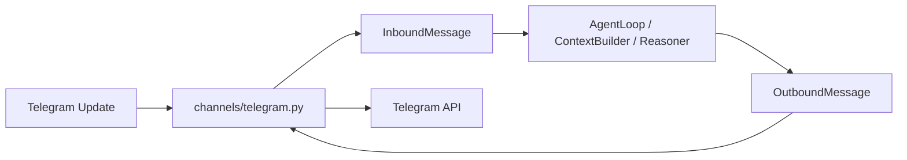
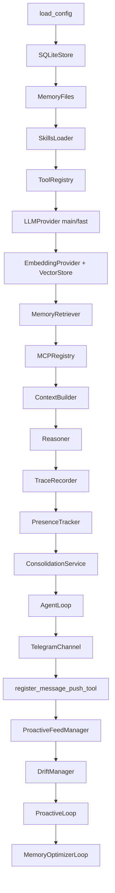
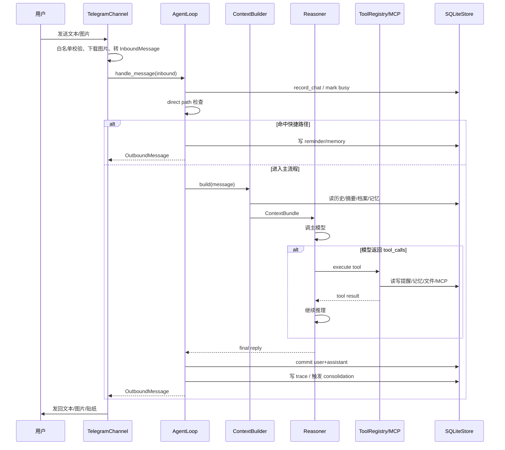
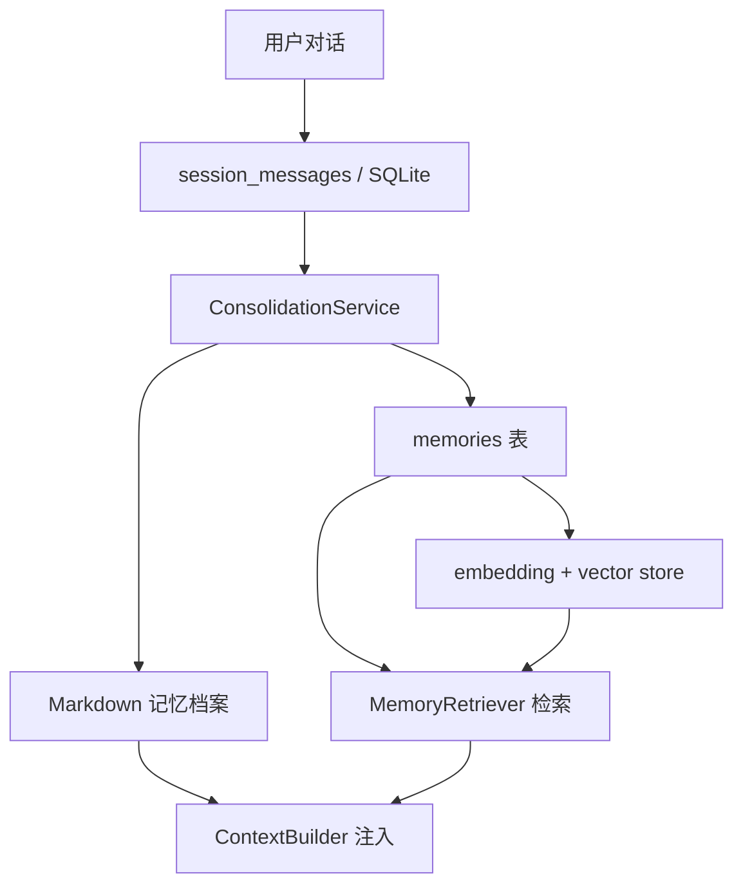
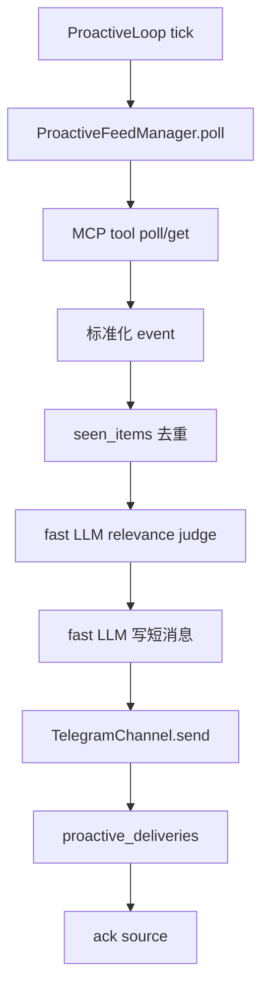
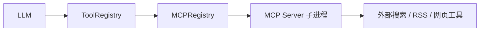
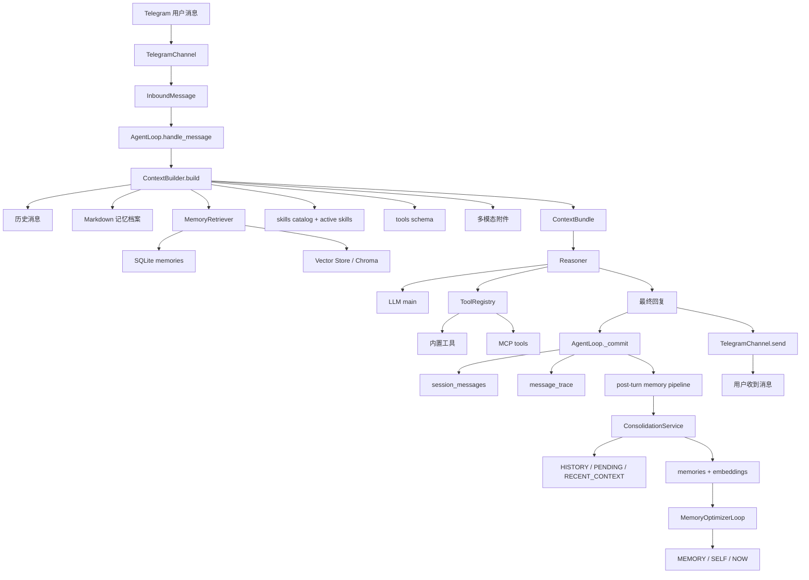

# Telegram 个人智能体项目学习文档

本文档基于当前仓库实际代码整理，目标是帮助你系统理解这个项目的功能边界、模块职责、运行链路、数据落盘方式，以及后续扩展时应该从哪里下手。

文档尽量做到两件事：

1. 只写当前项目里已经真实存在的实现，不凭空捏造。
2. 不只介绍“有什么文件”，还说明“这些文件在运行时是怎么串起来的”。


## 1. 项目定位

这是一个 **Telegram-only 的个人智能体项目**。它的目标不是做复杂多通道平台，而是在单一 Telegram 场景下，把一个长期运行的个人助手闭环做好。

当前项目已经覆盖了这些核心能力：

- 被动对话：用户发消息后，Bot 读取上下文、检索记忆、调用 LLM、必要时调工具，再回复用户。
- 长期记忆：支持 SQLite 结构化记忆、Markdown 文本档案、向量检索增强。
- 工具系统：支持内置工具、MCP 工具、技能说明书（SKILL.md）辅助。
- 主动系统：支持提醒、feed source、drift、轻量 context fallback。
- 多模态：支持 Telegram 图片输入，主模型开启视觉能力时可把图片放进上下文。
- 表情包与 emoji：被动回复和主动消息都能带 emoji / 本地表情包。
- 可观测性：关键链路会写入 SQLite trace 表，方便排查。

这个项目整体风格更接近：

- `channel` 只管收发
- `loop/context/reasoner` 负责业务编排
- `memory/proactive/mcp/tools/skills` 独立演进

而不是把所有逻辑都塞进 Telegram handler 里。


## 2. 目录与职责总览

仓库当前最核心的目录和文件如下：

```text
main.py
config.toml / config.example.toml

chat_agent/
  agent/
    provider.py
  channels/
    telegram.py
  context.py
  loop.py
  logging_setup.py
  mcp/
    registry.py
  memes.py
  memory/
    consolidation.py
    embeddings.py
    files.py
    optimizer.py
    retriever.py
    store.py
    vector_store.py
  messages.py
  observe/
    trace.py
  presence.py
  proactive/
    drift.py
    feed.py
    loop.py
  reasoner.py
  reply_format.py
  scheduler.py
  skills.py
  tools/
    builtin.py
    registry.py

skills/
workspace/
tests/
```

可以先把它理解成这几层：

### 2.1 入口层

- `main.py`
  - 加载配置
  - 初始化 workspace
  - 装配所有模块
  - 启动 Telegram Bot / proactive loop / memory optimizer loop

### 2.2 通道层

- `chat_agent/channels/telegram.py`
  - 负责 Telegram long polling
  - 处理 `/start` `/help` `/status` 等命令
  - 处理白名单鉴权
  - 下载图片
  - `Telegram Update -> InboundMessage`
  - `OutboundMessage -> Telegram API`

### 2.3 业务编排层

- `chat_agent/loop.py`
  - 一条消息从进来到回复的主流程
- `chat_agent/context.py`
  - 把 system prompt、历史、记忆、技能、工具说明拼成上下文
- `chat_agent/reasoner.py`
  - 负责 LLM 推理和工具循环

### 2.4 能力层

- `chat_agent/tools/`
  - 内置工具和工具注册中心
- `chat_agent/mcp/registry.py`
  - MCP server 管理和 MCP tool 接入
- `chat_agent/skills.py`
  - SKILL.md 技能说明书系统

### 2.5 记忆层

- `chat_agent/memory/store.py`
  - SQLite 总存储
- `chat_agent/memory/retriever.py`
  - 记忆检索编排
- `chat_agent/memory/consolidation.py`
  - 会话整理为长期记忆
- `chat_agent/memory/files.py`
  - Markdown 记忆档案层
- `chat_agent/memory/optimizer.py`
  - `PENDING.md -> MEMORY.md` 优化循环
- `chat_agent/memory/vector_store.py`
  - 向量存储抽象

### 2.6 主动系统层

- `chat_agent/proactive/loop.py`
  - 主动 tick 主循环
- `chat_agent/proactive/feed.py`
  - 外部 feed source 拉取
- `chat_agent/proactive/drift.py`
  - 空闲任务 drift
- `chat_agent/presence.py`
  - active/busy 状态管理

### 2.7 观测层

- `chat_agent/observe/trace.py`
  - 写入 message trace
- `chat_agent/memory/store.py`
  - 同时也承载 proactive log / MCP tool log / drift run 等表


## 3. 统一消息模型

项目内部不直接传 Telegram 原始对象，而是先转换成统一 dataclass。

定义位置：

- `chat_agent/messages.py`

最关键的几个结构：

- `Attachment`
  - 入站附件
  - 当前主要是图片
- `OutboundAttachment`
  - 出站附件
  - 当前支持 `photo` / `sticker`
- `InboundMessage`
  - 统一入站消息
- `OutboundMessage`
  - 统一出站消息

这一步很重要，因为它把业务层和 Telegram SDK 解耦了。

可以把它理解成：



这样做的好处是：

- `ContextBuilder` 不需要知道 `Update.message.photo`
- `Reasoner` 不需要关心 Telegram 具体 API
- 工具系统可以只依赖统一的 `ToolContext`
- 以后即便加别的 channel，也不必重写业务层


## 4. 启动链路：`main.py` 在做什么

项目启动入口在 `main.py`。

### 4.1 `python main.py init`

初始化逻辑会创建这些基础目录和文件：

- `workspace/`
- `logs/`
- `observe/`
- `workspace/memory/`
- `workspace/skills/`
- `workspace/drift/skills/`
- `config.example.toml`
- `workspace/mcp_servers.json`
- `workspace/proactive_sources.json`
- `workspace/drift_tasks.json`
- `workspace/rss_feeds.opml`

也就是说，`init` 不只是拷一个示例配置，它还把后续运行要用的工作区骨架搭好了。

### 4.2 `python main.py`

正常启动时，`main.py` 大致按这个顺序装配对象：



其中几个关键点：

- 主模型和快模型会分别创建 `LLMProvider`
- 如果启用了 embedding，会创建 `EmbeddingProvider` 和向量库
- 如果启用了 MCP，会先 `await mcp_registry.load()`
- `TelegramChannel` 持有的是 `agent.handle_message`
- `register_message_push_tool()` 会把主动发消息工具注册回工具系统
- 启动后会并行跑：
  - Telegram channel
  - proactive loop
  - memory optimizer loop


## 5. 配置系统

配置加载在：

- `chat_agent/config.py`

当前配置已经不是简单一层结构，而是分块管理。

主要配置块包括：

- `[llm.main]`
- `[llm.fast]`
- `[telegram]`
- `[memory]`
- `[embedding]`
- `[tools]`
- `[mcp]`
- `[skills]`
- `[proactive]`
- `[proactive.target]`
- `[proactive.context_fallback]`
- `[proactive.feed]`
- `[proactive.presence]`
- `[proactive.drift]`
- `[scheduler]`
- `[logging]`
- `[observe]`

### 5.1 环境变量展开

配置支持：

```toml
api_key = "${QWEN_API_KEY}"
token = "${TELEGRAM_BOT_TOKEN}"
```

`config.py` 会递归展开 `${ENV_NAME}`。如果环境变量缺失，会抛出明确的 `ConfigError`，而不是让程序在很深的调用栈里才炸掉。

### 5.2 主/快模型

当前项目明确区分：

- `llm.main`
  - 普通对话
  - 多模态图片理解
  - 工具循环主推理
- `llm.fast`
  - query rewrite
  - HyDE
  - memory route decision
  - proactive relevance / rewrite / check-in

如果 `fast` 和 `main` 指向同一个模型/地址，程序会打 warning，但允许这样运行。


## 6. 被动对话主链路

这是项目最核心的一条链。

用户在 Telegram 发一条消息后，整体调用链如下：



### 6.1 Telegram 通道层做了什么

`chat_agent/channels/telegram.py` 负责：

- long polling
- `/start` `/help` `/status` `/memory` `/forget` `/mcp` `/mcp_reload` `/skills` `/proactive_status`
- `allow_from` 白名单
- 图片下载
- `text/photo -> InboundMessage`

它还支持出站附件：

- 纯文本 -> `send_message`
- 图片 -> `send_photo`
- 贴纸 -> `send_sticker`

### 6.2 `AgentLoop.handle_message()`

`chat_agent/loop.py` 是被动对话的编排器。

它处理一条消息时主要做这些事：

1. 记录 chat 信息
2. 标记当前 chat 为 busy
3. 优先尝试 direct path
4. 否则构建上下文
5. 调用 `Reasoner`
6. 提交当前轮对话和 trace
7. 调度 post-turn memory pipeline
8. 为出站消息自动补 emoji / 表情包

### 6.3 direct path 是什么

有些意图不需要走完整 LLM 流程，`AgentLoop` 会先用规则处理：

- `记住：xxx`
- “你记得什么 / 回忆一下 xxx”
- “1分钟后提醒我喝水”
- 带图片且包含“存成表情包：happy”这一类文本

这样做的好处是：

- 更稳定
- 更便宜
- 响应更快
- 对关键命令不依赖模型是否“理解到位”


## 7. ContextBuilder：上下文是怎么拼出来的

上下文构建在：

- `chat_agent/context.py`

它的输出是 `ContextBundle`，里面包含：

- `messages`
- `memory_hits`
- `trace`

### 7.1 注入内容

当前 `ContextBuilder` 会组合这些内容：

1. system / identity prompt
2. 当前时间
3. 最近 N 条历史消息
4. conversation summary
5. 用户画像
6. Markdown 记忆档案
   - `RECENT_CONTEXT.md`
   - `MEMORY.md` 摘要
7. 检索召回的 memories
8. 可见工具说明
9. skills catalog
10. 当前轮激活的完整 skill
11. 当前用户消息
12. 如果有图片，则把图片做成 OpenAI-compatible 多模态 content

### 7.2 prompt 控制

当前实现非常重视 prompt 不无限增长：

- 历史消息只取最近 `history_window`
- memory 只取 `top_k`
- `MEMORY.md` 只读尾部摘要
- `RECENT_CONTEXT.md` 只读尾部
- skills catalog 有 `max_catalog_chars`
- 超长时会优先裁剪技能 catalog，而不是裁掉用户当前输入

### 7.3 prompt breakdown 日志

构建完成后，日志里会打印类似：

- `identity_chars`
- `history_chars`
- `memory_chars`
- `tools`
- `attachments`
- `skills_catalog`
- `active_skills`
- `total_chars`

这个日志对于排查“为什么 prompt 越来越长”“为什么模型开始失控”非常有用。


## 8. Reasoner：LLM 和工具循环怎么跑

实现位置：

- `chat_agent/reasoner.py`

它负责：

- 调主模型
- 识别 tool calls
- 执行工具
- 把结果喂回模型继续推理
- 最终收敛成可发给用户的普通文本

### 8.1 支持两种工具调用协议

当前项目支持两种形式：

#### 1. OpenAI-compatible `tool_calls`

也就是标准 chat completion 工具调用。

#### 2. 文本协议

格式类似：

```xml
<tool_call name="memorize">
{"content":"用户喜欢简洁回答"}
</tool_call>
```

这意味着即便模型不稳定支持 function calling，项目仍然能跑一个简化工具循环。

### 8.2 工具循环保护

当前实现里有几层保护：

- 最大迭代次数 `max_iterations`
- 同一工具 + 同一参数重复超过 2 次就终止
- 工具参数 JSON 解析失败时，返回错误结果给模型
- 工具执行异常不会让整个 bot 崩溃
- 如果模型一直不收敛，会触发一次“禁止再调工具，只输出最终答案”的收束 prompt

### 8.3 没有视觉能力时的保护

如果用户发了图片，而主模型配置没有 `enable_vision=true`，`Reasoner` 会直接返回友好提示，而不是让模型在没有图片理解能力的情况下乱答。


## 9. 工具系统

工具定义在：

- `chat_agent/tools/registry.py`
- `chat_agent/tools/builtin.py`

### 9.1 ToolRegistry 的角色

它负责：

- 注册工具
- 控制哪些工具可见
- 暴露给 LLM 的 schema
- 根据名字执行工具
- 支持 `tool_search` + `unlock`

### 9.2 当前内置工具

按实际代码，当前内置工具主要包括：

- 记忆类
  - `memorize`
  - `recall_memory`
- 提醒类
  - `create_reminder`
  - `list_reminders`
  - `cancel_reminder`
- 网络类
  - `web_fetch`
- 文件类
  - `list_files`
  - `read_file`
  - `write_file`
- 工具管理
  - `tool_search`
- skills 类
  - `list_skills`
  - `read_skill`
  - `create_skill`
  - `update_skill`
- 主动消息 / 表情包类
  - `send_message`
  - `send_emoji`
  - `list_memes`
  - `send_meme`

### 9.3 主动发送工具的限制

`send_message` / `send_meme` 不是任意 chat 都能发。

当前代码只允许发到：

- 当前会话 chat
- 或配置里的 proactive target chat

这是一个很重要的安全边界，避免模型把消息随便发到别的地方。


## 10. Skills 系统：SKILL.md 说明书层

实现位置：

- `chat_agent/skills.py`
- `skills/`
- `workspace/skills/`
- `workspace/drift/skills/`

### 10.1 skills 和 tools 的区别

这个项目里：

- `tools` = Agent 可以直接执行的动作
- `skills` = Agent 做事前阅读的说明书 / SOP

也就是说，skill 本身不是一个 API 调用，而是一段给模型看的“做这类事情应该怎么做”的文本。

### 10.2 skill 来源

当前 skill 有两类来源：

- 内置 skill：`skills/`
- workspace skill：`workspace/skills/`

同名时：

- `workspace` 覆盖 `builtin`

### 10.3 SKILL.md 元信息

系统会读取 `SKILL.md` 顶部 front matter，例如：

- `name`
- `description`
- `metadata.chat_agent.always`
- `metadata.chat_agent.requires.bins`
- `metadata.chat_agent.requires.env`

这使得 skill 可以声明：

- 是否每轮都要完整注入
- 本机缺什么命令
- 缺什么环境变量

### 10.4 skill 如何进入上下文

`ContextBuilder` 当前会注入：

1. skills catalog 摘要
2. `always=true` 的完整 skill 正文
3. 本轮用户显式触发的完整 skill

显式触发规则包括：

- `@weather`
- `skill:weather`
- 文本中直接出现 skill 名


## 11. 记忆系统：这是项目最值得细看的部分

当前项目的记忆不是单层实现，而是 **三层同时存在**。



### 11.1 第一层：原始对话层

存储位置：

- `chat_agent/memory/store.py`
- SQLite 表：`session_messages`

这一层保存的是原始对话消息。

当前 `AgentLoop._commit()` 每轮都会写两条：

1. `user`
2. `assistant`

如果有附件，会把附件信息也拼进 user history content。

这层是最底层原料，后面的 consolidation 就是从这里抽旧窗口。

### 11.2 第二层：结构化长期记忆层

存储位置：

- SQLite 表：`memories`
- SQLite 表：`memory_embeddings`
- 或外部向量库（由 `vector_store.py` 决定）

`memories` 表当前已经包含不少长期记忆管理字段，例如：

- `id`
- `chat_id`
- `type`
- `content`
- `tags`
- `created_at`
- `updated_at`
- `importance`
- `last_used_at`
- `content_hash`
- `status`
- `source_ref`
- `extra_json`
- `reinforcement`
- `emotional_weight`

这使得它已经不只是“存一段文本”，而是开始具备：

- 去重与强化
- supersede
- 来源追踪
- 情绪权重
- 后续重新整理的基础能力

### 11.3 第三层：Markdown 档案层

由：

- `chat_agent/memory/files.py`

统一管理这些文件：

- `workspace/memory/MEMORY.md`
- `workspace/memory/HISTORY.md`
- `workspace/memory/PENDING.md`
- `workspace/memory/RECENT_CONTEXT.md`
- `workspace/memory/SELF.md`
- `workspace/memory/NOW.md`

这一层是偏 Akashic 风格的“文本档案层”。

它的价值在于：

- 便于人工查看
- 便于 prompt 注入
- 便于把记忆组织成比较自然的文字档案
- 即使不用向量检索，也能提供长期上下文摘要


## 12. 记忆检索链路

记忆检索实现位置：

- `chat_agent/memory/retriever.py`

当前流程不是单纯 `LIKE '%query%'`，而是已经带一点增强版路由。

### 12.1 当前检索步骤

1. `fast_provider` 判断本轮是否值得检索
2. 如开启 query rewrite，则改写检索查询
3. 如开启 HyDE，则生成假想记忆查询
4. 从 SQLite 记忆中做关键词检索
5. 如果启用了 embedding + vector store，再做向量检索
6. 合并去重
7. 把结果交给 `ContextBuilder`

### 12.2 检索结果如何进入 prompt

当前 prompt 里的记忆来源至少有三类：

1. `RECENT_CONTEXT.md`
2. `MEMORY.md` 摘要
3. `MemoryRetriever` 返回的 `memory_hits`

所以当前项目已经不是“单一记忆来源”，而是：

- 文本档案层
- 结构化记忆层
- 向量检索层

三者共同参与上下文构建。


## 13. 会话整理与记忆归档链路

这条链是项目长期运行能力的关键。

实现位置：

- `chat_agent/memory/consolidation.py`

### 13.1 什么时候整理

`AgentLoop._commit()` 在每轮提交后会调度：

- `_schedule_consolidation(chat_id)`

也就是：被动回复完成后，会异步触发一次整理检查。

### 13.2 整理窗口怎么取

`ConsolidationService.run_once(chat_id)` 会：

1. 读取 `last_consolidated`
2. 从 `session_messages` 里取这之后的旧消息
3. 保留最近 `keep_recent` 条不动
4. 单次最多整理 `max_window` 条

这样做是为了：

- 最近上下文继续给主对话用
- 旧消息再慢慢归档

### 13.3 整理产物

一次整理会把窗口抽成四类内容：

- `history_entries`
  - 写入 `HISTORY.md`
  - 也会转成 `event` memory
- `pending_items`
  - 写入 `PENDING.md`
- `memories`
  - 写入 `memories` 表
  - 可带 `supersedes`
  - 可生成 embedding
- `recent_context`
  - 写入 `RECENT_CONTEXT.md`

### 13.4 幂等与 checkpoint

当前代码里已经有这套控制：

- `consolidation_state`
- `consolidation_events`
- `memory_replacements`
- `source_ref`
- `last_consolidated`

整理成功后才会推进 `last_consolidated`。  
如果失败，下次还可以重跑旧窗口，不会因为中途失败而把记忆“吃掉”。


## 14. Markdown 记忆文件层怎么工作

实现位置：

- `chat_agent/memory/files.py`

它不负责 LLM 提炼，只负责“安全地读写这些 Markdown 文件”。

### 14.1 幂等追加

几个关键方法：

- `append_history_once(source_ref, text)`
- `append_pending_once(source_ref, text)`
- `append_memory_once(source_ref, text)`

本质上是给每段追加内容加一个：

```html
<!-- source_ref:... -->
```

标记，这样相同窗口不会重复写。

### 14.2 snapshot / rollback

针对 `PENDING.md`，它支持：

- `snapshot_pending()`
- `commit_pending_snapshot()`
- `rollback_pending_snapshot()`

也就是说，优化器在处理 `PENDING.md` 时不是直接粗暴清空，而是先拍快照，成功再提交，失败就回滚。

这对于“长期运行不丢候选记忆”非常关键。


## 15. Memory Optimizer：`PENDING.md -> MEMORY.md`

实现位置：

- `chat_agent/memory/optimizer.py`

### 15.1 它做什么

`consolidation` 负责把旧窗口抽成候选结果，但不是所有内容都应该立即进入最终档案。

所以当前设计是：

- 先放进 `PENDING.md`
- 再由 `MemoryOptimizer` 定期合并进 `MEMORY.md`

同时还能更新：

- `SELF.md`
- 清空 `NOW.md`

### 15.2 运行方式

后台有一个：

- `MemoryOptimizerLoop`

由 `main.py` 在启动时一起创建任务运行。

它会定时执行：

- `optimizer.run_once()`

### 15.3 失败保护

如果合并失败：

- rollback 快照
- `PENDING.md` 不丢
- 下次还能继续优化


## 16. SQLite 数据库：到底存了什么

SQLite 存储实现位置：

- `chat_agent/memory/store.py`

这个文件是全项目最大的持久化入口之一。

当前能看到的重要表包括：

- `chats`
- `session_messages`
- `memories`
- `memory_embeddings`
- `conversation_summaries`
- `user_profiles`
- `reminders`
- `message_trace`
- `proactive_tick_log`
- `proactive_deliveries`
- `seen_items`
- `mcp_tool_log`
- `drift_runs`
- `consolidation_state`
- `consolidation_events`
- `memory_replacements`

可以粗略理解成：

### 16.1 会话类

- `chats`
- `session_messages`
- `conversation_summaries`
- `user_profiles`

### 16.2 长期记忆类

- `memories`
- `memory_embeddings`
- `consolidation_state`
- `consolidation_events`
- `memory_replacements`

### 16.3 提醒与主动系统类

- `reminders`
- `proactive_tick_log`
- `proactive_deliveries`
- `seen_items`
- `drift_runs`

### 16.4 观测类

- `message_trace`
- `mcp_tool_log`


## 17. 提醒系统

提醒相关能力由两部分组成：

- `chat_agent/scheduler.py`
- `chat_agent/memory/store.py`
- `chat_agent/proactive/loop.py`

### 17.1 被动侧创建提醒

用户说：

- “1分钟后提醒我喝水”

会先在 `AgentLoop._handle_direct_paths()` 里被 `parse_after_reminder()` 识别。

识别成功后：

- 写入 `reminders`
- 直接回复用户已创建

### 17.2 主动侧发送提醒

`ProactiveLoop.tick()` 每次先做：

1. `get_due_reminders()`
2. 如果有 due reminders，就先发提醒
3. 发完后 `mark_reminder_delivered()`

所以提醒在主动系统里优先级最高。


## 18. 主动系统：Proactive Loop

实现位置：

- `chat_agent/proactive/loop.py`

### 18.1 当前调度优先级

每次 tick 的顺序是：

1. due reminders
2. feed source
3. drift
4. context fallback

这个顺序是写死在当前代码里的。

### 18.2 频率控制

主动消息不是随便发，当前至少受这些限制：

- `target_chat_id`
- `presence busy`
- `cooldown`
- `daily_max`
- `probability`（context fallback）

### 18.3 tick 日志

每次 proactive tick 都会写日志和数据库记录，便于排查：

- 发送了什么
- 为什么跳过
- due reminders 数量
- feed 内容数量
- sent_count
- error


## 19. Feed Source：外部信息源怎么接入

实现位置：

- `chat_agent/proactive/feed.py`
- `workspace/proactive_sources.json`

### 19.1 当前 feed 不是内置 RSS 抓取器

当前项目的思路是：

- feed source 通过 MCP server 提供
- `ProactiveFeedManager` 负责轮询这些 source

所以它本身更像“feed 编排器”，而不是“直接去抓网页”。

### 19.2 一个 source 至少包含什么

在 `proactive_sources.json` 中，一个 source 通常包括：

- `server`
- `poll_tool`
- `get_tool`
- `ack_tool`
- `enabled`

### 19.3 主动推送 feed 内容的链路




## 20. Drift：空闲时的自主任务

实现位置：

- `chat_agent/proactive/drift.py`

### 20.1 drift 什么时候跑

在 proactive tick 里：

- reminder 没命中
- feed 没内容

才会尝试 drift。

### 20.2 drift 的任务来源

当前 drift 支持两类来源：

1. `workspace/drift/skills/`
2. `workspace/drift_tasks.json`

也就是说，它既可以：

- 跑一个结构化 skill

也可以：

- 跑一个旧式固定任务配置

### 20.3 drift 输出

执行结果会写到：

- `workspace/drift_runs/`

如果 drift 产出适合通知用户的短消息，`ProactiveLoop` 会主动发给目标 chat。


## 21. Presence：busy / active 的作用

实现位置：

- `chat_agent/presence.py`

这个模块的作用很朴素，但很重要：

- 用户刚发过消息，说明人当前活跃
- 某个 chat 正在被 `AgentLoop` 处理，说明当前 busy

主动系统会参考这些状态，避免：

- 用户刚问完问题，bot 又突然主动插话
- bot 正在处理消息时，另一个 proactive 消息并发插进来


## 22. MCP：外部工具如何挂进来

实现位置：

- `chat_agent/mcp/registry.py`
- `workspace/mcp_servers.json`

### 22.1 当前 MCP 实现是什么级别

当前实现是一个 **轻量 stdio MCP client**。

它支持：

- 读 `mcp_servers.json`
- 启动 MCP server 子进程
- `initialize`
- `tools/list`
- `tools/call`
- 把 MCP tools 注册进 `ToolRegistry`

### 22.2 当前并不是“模型自动直连外网”

这里很容易误解。

当前项目里：

- 模型本身不会直接联网
- 它是通过工具系统调用 MCP tool
- MCP tool 再去访问外部搜索/网页/RSS 等能力

也就是：



### 22.3 MCP tool 日志

MCP 工具调用结果会写入：

- `mcp_tool_log`

这对于排查“为什么模型没有拿到搜索结果”“MCP server 是否超时”特别有帮助。


## 23. 表情包和 emoji 系统

实现位置：

- `chat_agent/memes.py`
- `workspace/files/memes/`

### 23.1 两部分能力

当前这块分成两部分：

#### 1. `MemeCatalog`

负责：

- 读 `workspace/files/memes/manifest.json`
- 如果没有 manifest，就直接扫描目录
- 根据 `query/category` 选一个最匹配的表情包

#### 2. `MemeService`

负责：

- 把用户发来的图片收录进表情包库
- 根据上下文给出站消息自动挂表情包

### 23.2 被动消息里的用法

例如用户发一张图并说：

- “存成表情包：happy”

`AgentLoop` 会优先把它识别成 direct path，然后：

- 复制到 `workspace/files/memes/happy/`
- 更新 `manifest.json`

### 23.3 主动消息里的用法

`ProactiveLoop` 在发送：

- reminder
- feed
- drift
- context fallback

这些消息前，也会经过 `_decorate_outbound()`，因此主动消息也可以带本地表情包。


## 24. 图片输入与多模态

图片输入主要在：

- `chat_agent/channels/telegram.py`
- `chat_agent/agent/provider.py`
- `chat_agent/context.py`

### 24.1 Telegram 层

Telegram channel 收到图片后会：

- 做大小限制检查
- 下载文件
- 构造成 `Attachment`
- 挂到 `InboundMessage.attachments`

### 24.2 ContextBuilder 层

构建上下文时，如果：

- 当前消息带图片
- 主模型开启 `enable_vision=true`

就会把：

- 文本
- 图片

组装成 OpenAI-compatible 多模态 content。

### 24.3 Provider 层

`chat_agent/agent/provider.py` 支持把这种 content 发到 OpenAI-compatible chat completion API。

如果模型没开视觉能力，前面 `Reasoner` 就会提前拦住并返回友好提示。


## 25. LLM Provider：错误是怎么兜住的

实现位置：

- `chat_agent/agent/provider.py`

当前 provider 做的不只是“发请求”，还包括错误降级。

它会对这些情况做友好处理：

- 401
- 429
- timeout
- 网络错误
- API 层错误

目标是：

- 不让整个 bot 因为一次外部 API 失败崩掉
- 给用户返回可读提示
- 同时在日志中保留排查信息


## 26. Observe / Trace：怎么查问题

实现位置：

- `chat_agent/observe/trace.py`
- `chat_agent/memory/store.py`

### 26.1 被动消息 trace

`AgentLoop` 每次处理完都会记录：

- user_message
- assistant_reply
- tools_used
- memory_hits
- latency_ms
- error
- mcp_tools_used
- hyde_used
- attachments_count

### 26.2 proactive trace

`ProactiveLoop` 每次 tick 也会写：

- action
- skip_reason
- reminders_due
- content_count
- sent_count
- error

### 26.3 MCP trace

MCP 工具调用还会单独写：

- server
- tool
- args_preview
- result_preview
- latency_ms
- error

所以当你发现：

- 模型没调用工具
- 工具调用了但没结果
- proactive 一直 skip
- 搜索结果没有送达用户

通常都可以从这些表里追出来。


## 27. 当前项目的完整数据链路

如果把整个系统压缩成一条总链，可以这么看：




## 28. 项目里几条最重要的“调用链”

这里再用更偏工程阅读的方式总结一下。

### 28.1 用户发文本消息

`TelegramChannel._on_message()`  
-> `InboundMessage`  
-> `AgentLoop.handle_message()`  
-> `ContextBuilder.build()`  
-> `Reasoner.run()`  
-> `ToolRegistry.execute()`（可选）  
-> `AgentLoop._commit()`  
-> `TraceRecorder.record_message()`  
-> `TelegramChannel.send()`

### 28.2 用户发图片消息

`TelegramChannel._on_message()`  
-> 下载图片 / 生成 `Attachment`  
-> `InboundMessage.attachments`  
-> `ContextBuilder.make_multimodal_user_content()`  
-> `Reasoner.run()`  
-> 主模型多模态推理  
-> `AgentLoop._commit()`  
-> `TelegramChannel.send()`

### 28.3 用户创建提醒

`TelegramChannel._on_message()`  
-> `AgentLoop._handle_direct_paths()`  
-> `parse_after_reminder()`  
-> `SQLiteStore.add_reminder()`  
-> 立即回复创建成功

### 28.4 提醒到点主动推送

`ProactiveLoop.tick()`  
-> `SQLiteStore.get_due_reminders()`  
-> `TelegramChannel.send()`  
-> `mark_reminder_delivered()`  
-> `add_proactive_delivery()`

### 28.5 MCP 搜索工具调用

`Reasoner.run()`  
-> 模型返回 tool_call  
-> `ToolRegistry.execute()`  
-> MCP 包装工具  
-> `MCPRegistry.call_tool()`  
-> stdio MCP server  
-> 返回结果给模型继续推理


## 29. 这个项目当前已经实现到什么程度

如果从“一个长期运行的 Telegram 个人助手”这个角度看，当前项目已经具备：

- 一个清晰的 Telegram-only 主闭环
- 主/快模型分工
- 多模态图片输入
- 工具循环
- MCP 接入
- feed source
- drift
- SQLite + Markdown + 向量三层记忆
- 主动提醒和主动推送
- 表情包与 emoji 支持
- trace 和日志

换句话说，它已经不是“简单能回一句话的 bot 骨架”，而是一个结构比较完整、能够继续往上长的个人智能体底座。


## 30. 仍然建议重点阅读的源码顺序

如果你准备真正读代码，我建议按下面顺序看，理解成本最低：

1. `README.md`
2. `main.py`
3. `chat_agent/messages.py`
4. `chat_agent/channels/telegram.py`
5. `chat_agent/loop.py`
6. `chat_agent/context.py`
7. `chat_agent/reasoner.py`
8. `chat_agent/tools/registry.py`
9. `chat_agent/tools/builtin.py`
10. `chat_agent/memory/store.py`
11. `chat_agent/memory/retriever.py`
12. `chat_agent/memory/consolidation.py`
13. `chat_agent/memory/files.py`
14. `chat_agent/memory/optimizer.py`
15. `chat_agent/proactive/loop.py`
16. `chat_agent/proactive/feed.py`
17. `chat_agent/proactive/drift.py`
18. `chat_agent/mcp/registry.py`
19. `chat_agent/skills.py`
20. `chat_agent/memes.py`

这个顺序的原因是：

- 先看“项目怎么跑起来”
- 再看“单条消息怎么处理”
- 再看“工具和记忆怎么补强”
- 最后看“主动系统和扩展能力”


## 31. 最后给一个阅读建议

读这类项目时，不建议一开始就陷进某个大文件逐行看。

更好的方式是：

1. 先把运行主链摸清楚  
   `main.py -> TelegramChannel -> AgentLoop -> ContextBuilder -> Reasoner -> commit`

2. 再把数据落盘主链摸清楚  
   `session_messages -> consolidation -> memories / Markdown files -> retriever -> prompt`

3. 最后再看主动系统  
   `ProactiveLoop -> feed / drift / reminder -> send`

只要这三条链看清了，这个项目的整体骨架就算真的吃透了一大半。


## 32. 文档对应的关键源码位置

为了方便你边看文档边跳代码，这里列出最关键的入口文件：

- `main.py`
- `chat_agent/messages.py`
- `chat_agent/channels/telegram.py`
- `chat_agent/loop.py`
- `chat_agent/context.py`
- `chat_agent/reasoner.py`
- `chat_agent/agent/provider.py`
- `chat_agent/tools/builtin.py`
- `chat_agent/tools/registry.py`
- `chat_agent/memory/store.py`
- `chat_agent/memory/retriever.py`
- `chat_agent/memory/consolidation.py`
- `chat_agent/memory/files.py`
- `chat_agent/memory/optimizer.py`
- `chat_agent/proactive/loop.py`
- `chat_agent/proactive/feed.py`
- `chat_agent/proactive/drift.py`
- `chat_agent/mcp/registry.py`
- `chat_agent/skills.py`
- `chat_agent/memes.py`


---

如果把这份文档再往下一步打磨，我建议可以继续补两类内容：

1. “按一次真实消息样例逐行跟踪”的调试版说明  
2. “数据库表结构逐表解释”的存储版说明

这两份会更适合深入维护和二次开发。
